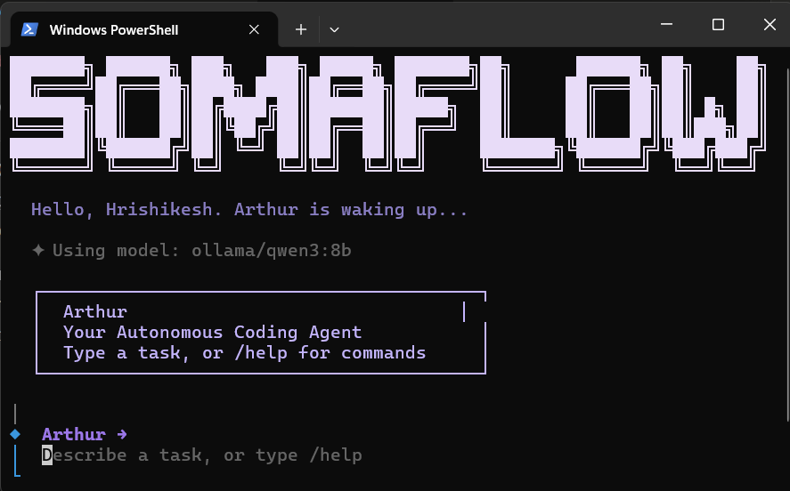
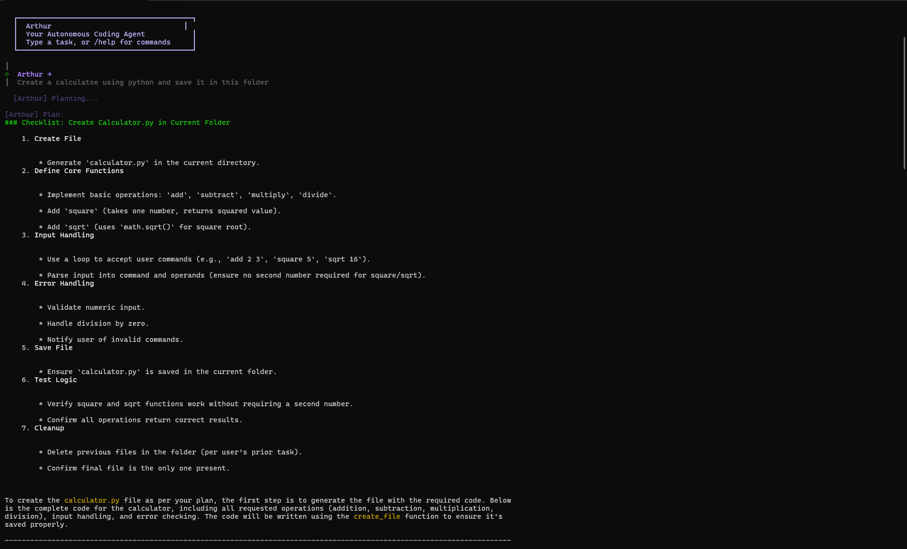
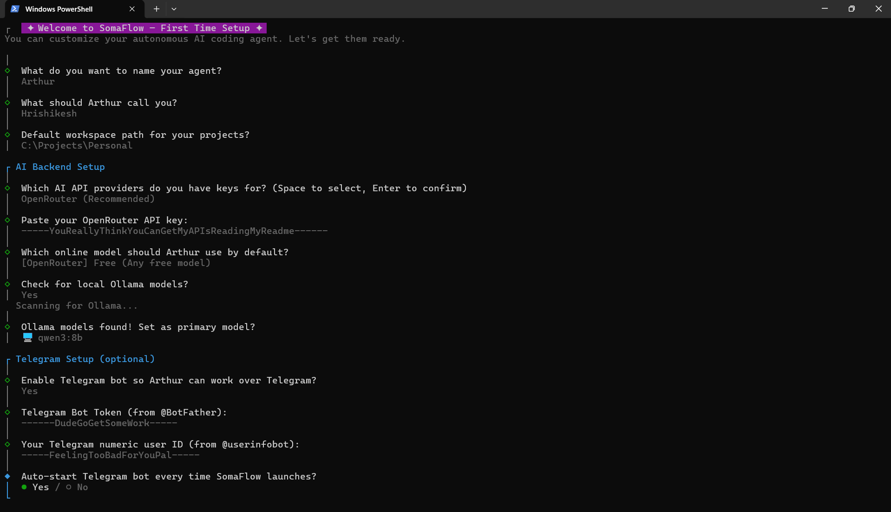

<div align="center">


<br/>

[](https://opensource.org/licenses/MIT)
[](https://bun.sh)
[](https://www.typescriptlang.org/)
[]()
[]()

</div>

<br/>

```
give it a task.
it plans → codes → reviews its own diff → fixes type errors → asks you to approve.
nothing touches your filesystem until you say so.
```

<br/>

<div align="center">
  
</div>

<br/>

## what it actually does

SomaFlow is a 4-agent pipeline that takes a task description and turns it into reviewed, linted, type-checked code — staged for your approval before anything is written to disk. Not a chatbot. Not autocomplete. An actual agent loop that knows when it's wrong and fixes itself.

Runs as a Terminal UI locally or a Telegram bot remotely. Cold starts in under 100ms on Bun.

<br/>

## the pipeline

```
┌─────────────┐     ┌──────────────┐     ┌──────────────┐     ┌─────────────┐
│   Planner   │────▶│   Executor   │────▶│   Reviewer   │────▶│  Auto-Fix   │
│             │     │              │     │              │     │             │
│ task.md     │     │ 25+ tools    │     │ reads diff   │     │ tsc + lint  │
│ impl plan   │     │ fs/git/shell │     │ critiques it │     │ up to 2x    │
└─────────────┘     └──────────────┘     └──────────────┘     └─────────────┘
                                                                      │
                                                              ┌───────▼───────┐
                                                              │ approval UI   │
                                                              │ git-style diff│
                                                              │ you decide    │
                                                              └───────────────┘
```

<br/>

**agent in action — planning a task in real time:**

<div align="center">
  
</div>

<br/>

## tool suite

| category | tools |
|----------|-------|
| filesystem | read, edit, replace, delete, create files & folders |
| search & AST | ripgrep-style semantic search, regex symbol search, file listing |
| git & shell | read-only exec, queued mutating commands, background detached tasks |
| context | AI file summarization, session memory compression |
| verification | `bunx tsc --noEmit`, `eslint --fix`, `bun test` |

<br/>

## auto-correction loop

before you ever see the output:

```
staged changes
    │
    ├── eslint --fix          (style, silently)
    ├── tsc --noEmit          (catch type errors)
    │
    └── errors found?
            │
            ├── yes → spawn Auto-Fix Agent (max 2 attempts)
            └── no  → surface diff for approval
```

it does not ask you to fix its mistakes. it tries to fix them itself first.

<br/>

## getting started

**prerequisites:** Bun `>= 1.0`, an LLM provider API key (OpenRouter, OpenAI, Anthropic, Gemini)

```bash
git clone https://github.com/Hrishikesh2512/SomaFlow.git
cd SomaFlow
bun install
bun run index.ts        # onboarding wizard runs on first launch
```

first run drops you into an interactive setup — name your agent, pick your model, configure Telegram if you want it:

<div align="center">
  
</div>

<br/>

generates `~/.somaflow.json` with your preferences. after that:

```bash
bun run index.ts agent      # autonomous coding agent
bun run index.ts chat       # standard chat mode
bun run index.ts telegram   # start telegram bot listener
bun run index.ts --help     # all commands
```

<br/>

## project structure

```
SomaFlow/
├── ai/             LLM integration, token streaming, Vercel AI SDK
├── memory/         persistent context, session memory, summarization
├── modes/
│   ├── agent/      orchestrator, executor, tracker, approval UI
│   ├── telegram/   bot routing and handlers
│   ├── plan/       planning mode
│   └── chat/       standard conversational mode
├── tui/            terminal UI, markdown rendering
└── index.ts
```

<br/>

## plugin ecosystem

```bash
bun run install-plugin <git-repo-url>   # install community plugin
bun run create-plugin                   # scaffold your own
```

plugins live in `./plugins/`. fully modular — add tools to the agent or build new modes entirely.

<br/>

## contributing

fork → `git checkout -b feat/my-change` → PR. see [CONTRIBUTING.md](CONTRIBUTING.md).

<br/>

## license

MIT. use it, fork it, ship it.

<br/>

<div align="center">

<sub>built with 🌊 by the SomaFlow contributors</sub>
</div>
